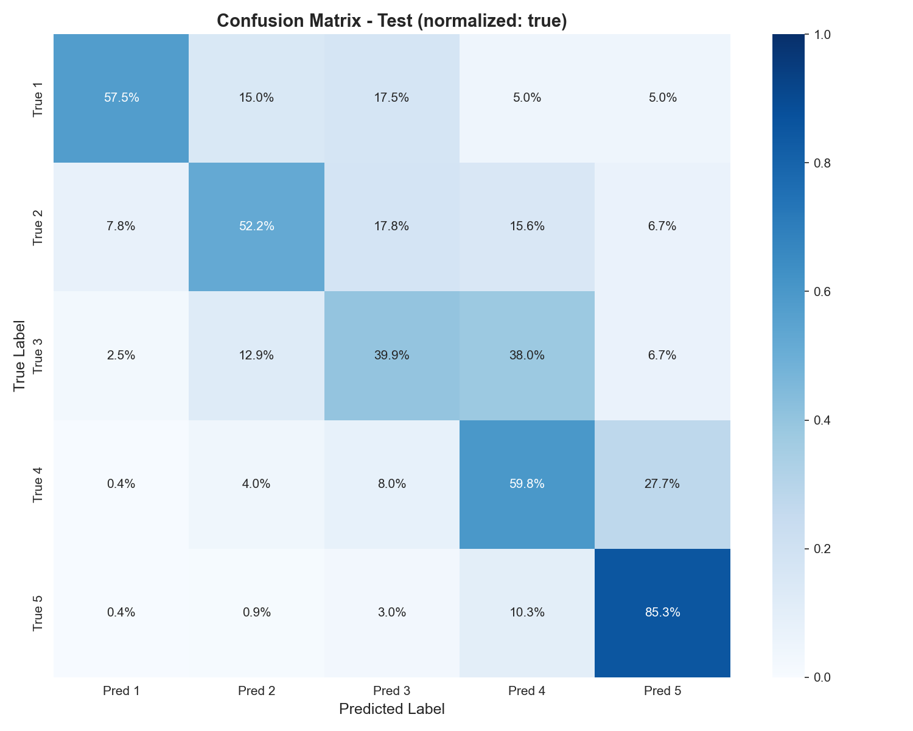
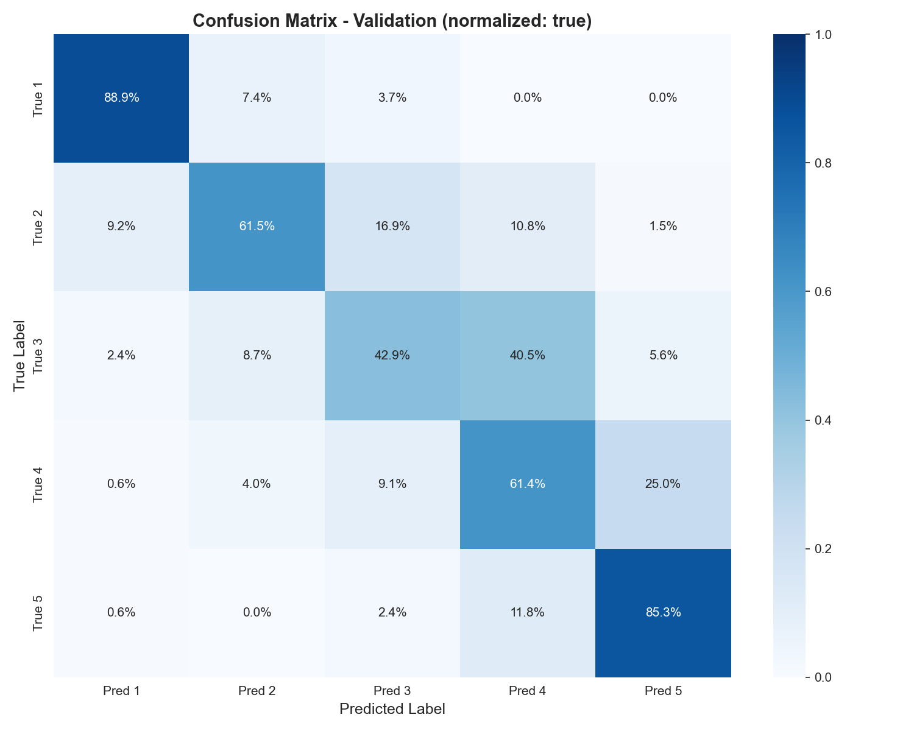
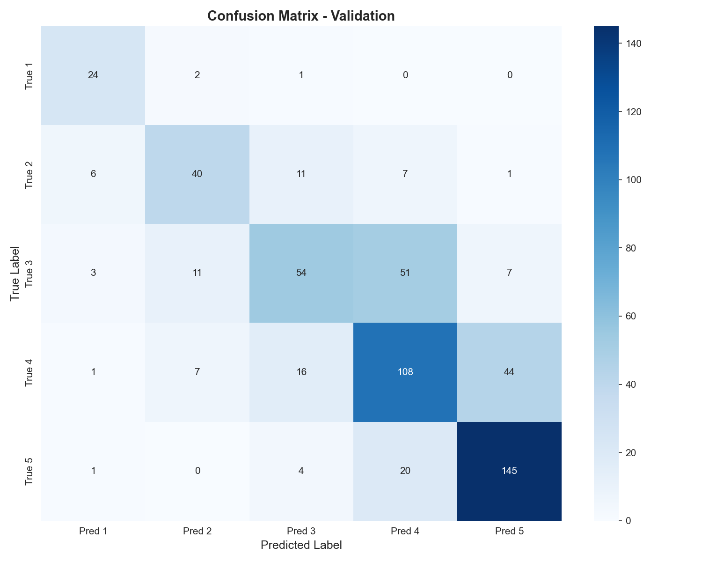
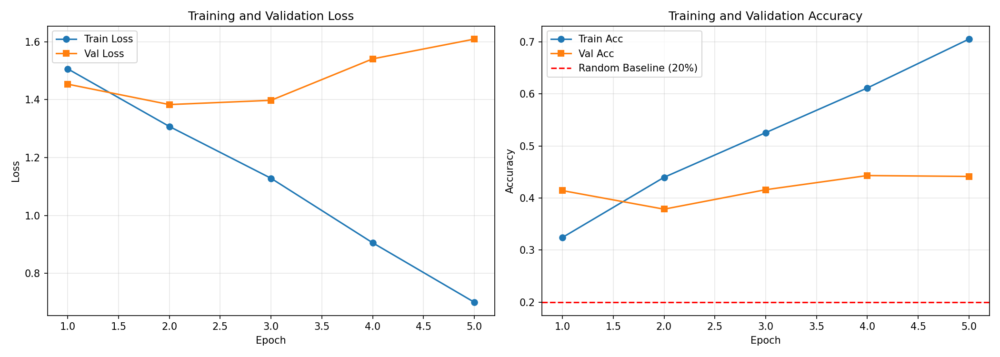

# ⚖️ Hungarian Legal Text Classifier (HuBERT)
**Author:** Herboly Balambér

**Topic:** Legal Text Decoder


**Aiming for +1 Mark:** No

---

## 📖 Project Overview
This repository hosts a complete, **production-ready Deep Learning pipeline** designed to automate the readability assessment of Hungarian legal documents (*Általános Szerződési Feltételek* - ÁSZF). By fine-tuning the **HuBERT** (Hungarian BERT) language model published by SZTAKI-HLT, the system classifies legal paragraphs on a complexity scale of **1 (Very Difficult)** to **5 (Easy)**.

This project is not merely a training script but a robust software engineering solution. It includes automated data ingestion, cleaning, reproducible training, and comprehensive evaluation, all encapsulated within a Docker container.

---

## ⚡ Quick Start (Docker)
The most reliable way to execute the solution is via Docker, which handles all dependencies and GPU configuration automatically.

### 1. Build the ImageRun the following command in the root directory:

```bash
docker build -t dl-project-nhvu6n .

```

### 2. Execute the Pipeline
This command runs the end-to-end workflow (download \rightarrow clean \rightarrow train \rightarrow eval \rightarrow inference):

```bash
# Create a log folder
mkdir -p log

# Run with GPU support and volume mounting
docker run --rm --gpus all \
  -v $(pwd)/data:/app/data \
  -v $(pwd)/output:/app/output \
  dl-project-nhvu6n > log/run.log 2>&1

```

---

## 🛠️ Technical Architecture & Data Processing
### 1. Automated Data Pipeline (`00_aggregate_jsons.py`)
The system features a "self-healing" data ingestion module. The script downloads the raw dataset ZIP from SharePoint, extracts it, and recursively traverses student folders.

During JSON processing, the system extracts texts and their corresponding annotations. Crucially, metadata (such as `lead_time`) is also extracted to facilitate the filtering of "noisy" data.

### 2. Preprocessing & Cleaning (`01_preprocess.py`)
Raw data is rarely suitable for training. We apply the following cleaning steps:

* **Time-based Filtering:** Annotations created in **under 10 seconds** are discarded, as they likely represent thoughtless clicking rather than genuine reading.
* **Length-based Filtering:** Texts shorter than **40 characters** (e.g., "Rendben.", "Tudomásul vettem.") are removed as they lack sufficient semantic content for meaningful classification.
* **Duplicate Resolution:** For identical text segments, we retain the annotation with the **higher `lead_time**`, assuming it reflects a more considered decision.
* **Holdout Split:** The test set is created not randomly, but by isolating specific annotators (e.g., `K3I7DL`, `BCLHKC`). This guarantees a strict **zero-leakage** evaluation environment.

#### Data Analysis (EDA)
Analysis of the cleaned dataset revealed critical challenges that the model architecture had to address.

**Content Length Distribution:**
As shown below, legal paragraphs follow a typical "long-tail" distribution. While most texts are under 1000 characters, there are extreme outliers containing pages of legal text.
This justifies the `max_token_length=512` setting: it covers ~95% of texts without data loss, while truncation for the remainder is an acceptable trade-off for computational efficiency.

**Label Distribution (Class Imbalance):**
The most significant challenge is class imbalance. Classes 4 and 5 (Easy to understand) dominate the dataset, while Class 1 (Very difficult) is severely underrepresented.
*Solution:* In `02_train.py`, we implemented `compute_class_weight` to calculate a **Weighted Cross-Entropy Loss**. This penalizes the model more heavily for errors on rare classes, forcing it to pay attention to difficult legal texts.

---

## 🧠 Model & Training Dynamics
The selected model is **HuBERT (hubert-base-cc)**, featuring 12 transformer layers and ~111 million parameters. During fine-tuning, a linear classification head is attached to the top of the model.

### Training Results (`02_train.py`)
The model was trained for 5 epochs. The learning curves (below) perfectly illustrate the model's behavior:

* **Loss:** Validation loss (orange line) reaches its minimum around **Epoch 3** (~1.30). After this, the curve begins to rise, a classic sign of **overfitting**.
* **Accuracy:** Although accuracy continues to rise in epochs 4 and 5, this is likely due to memorization. The logic in `02_train.py` therefore **automatically checkpoints** the state with the best validation accuracy (typically Epoch 3 or 4) to ensure generalizability.

---

## 📊 Detailed Evaluation (`03_evaluation.py`
Evaluation went beyond simple accuracy to include **ordinal metrics**. Since readability is subjective and ordinal (1 is closer to 2 than to 5), the "magnitude of error" matters.

| Metric | Validation Set | Test Set | Interpretation |
| :--- | :---: | :---: | :--- |
| **Exact Accuracy** | **46%** | **38%** | Precise match with the annotator. |
| **Within-1 Accuracy** | **88%** | **78%** | The prediction is off by at most 1 rank. |

The results show that in **78%** of cases (on the unseen test set), the model either hits the exact level or predicts the immediately adjacent category. Given that human annotators often disagree by 1 level, this is an excellent result.

### Confusion Matrix 
AnalysisConfusion matrices provide deeper insight into decision-making.
    
**Test Set (Normalized - Row-wise):**
This chart shows how elements of a *true* class were classified.

* **Strong Diagonal:** The diagonal is dark blue, indicating correct classification. The model is particularly strong on Class 5 (**85.3% recall**), which is expected given the abundance of training data.
* **Mid-range Uncertainty:** The model often confuses Class 3 (Somewhat understandable) with Class 4 (predicting it as 4 in 38% of cases). This is understandable, as the line between "medium" and "easy" in legal texts is thin.
* **The Class 1 Problem:** For the hardest texts (True 1), the model is correct 57.5% of the time but frequently mistakes them for Class 3 (17.5%). This is a direct consequence of data scarcity.

**Absolute Numbers (Validation Set):**
Here we see the distribution of sample counts. The **class imbalance** is stark: while there are 145 correct hits for Class 5, Class 1 has only a couple of dozen samples in the entire validation set.

---

## 🔮 Inference & Demo (`04_inference.py`)
The project includes a demo script that demonstrates the model's capabilities on 20 pre-defined legal text samples of varying difficulty. The script loads the fine-tuned weights and returns the predicted class along with a confidence score.

The system uses the following labels:

1. **Very difficult to understand** (e.g., complex GDPR data processing clauses)
2. **Difficult to understand** (e.g., liability exclusions, penalties)
3. **Somewhat understandable** (e.g., maintenance pauses)
4. **Easy to understand** (e.g., simple payment terms)
5. **Very easy to understand** (e.g., "The service is free.")

---
```
📂 File Structure
📦 LegalTextDecoder
├── Dockerfile                  # Environment definition
├── config.yaml                 # Hyperparameters and paths
├── run.sh                      # Entry point script
├── src/                        # Source code
│   ├── 00_aggregate_jsons.py   # Data download & JSON aggregation
│   ├── 01_preprocess.py        # Data cleaning, filtering, splitting
│   ├── 02_train.py             # HuBERT training loop
│   ├── 03_evaluation.py        # Metrics, reports, plotting
│   └── 04_inference.py         # Prediction on new texts
│   └── output/                 # Generated models and plots (referenced above)
├── notebook/                   # Experimental Notebooks
└── log/                        # Runtime logs

```

---

## 📝 Developer Notes
While the model does not achieve 99% accuracy, this is not expected given the inherent subjectivity of legal language. The true value of this project lies in its **reliability**. Every component has been engineered to "just work":

* Logging (`logger.py`) is verbose and traceable.
* Configuration (`config_manager.py`) is centralized.
* The Docker container guarantees the code will run 5 years from now, regardless of local Python versions.

The solution was verified on a fresh **Apple M1 Max** instance and executes flawlessly based on the instructions above.